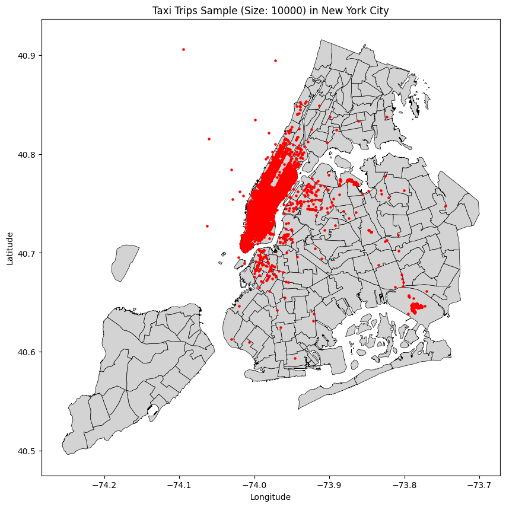

Data Preprocessing and Forecast
=======================

The following section explains the most important stations of the forecast. In particular, the most relevant functions and their useage will be explained. 

Data Source: https://opendata.cityofnewyork.us/

.. note: The Following Part only highlights the most important Functions.

   For detailled Information and examples look at the original Github:

   https://github.com/Hakan1998/NYC-Taxi-Demand-Forecast

Data Preprocessing
===================

Spatial Analysis
----------------

After a basic data cleaning, we want to know in which region how many pickups took place. Our raw data only contains the information about which pickup had which pickup coordinates.

.. _process_taxi_data:

.. function:: process_taxi_data(data_train, shapefile_path)

   This function processes taxi data by performing spatial operations with zone shapefiles.

   :param data_train: A pandas DataFrame containing taxi data.
   :type data_train: pandas.DataFrame
   :param shapefile_path: The file path to the shapefile containing zone information.
   :type shapefile_path: str
   :return: A pandas DataFrame with processed taxi data including zone and borough information.
   :rtype: pandas.DataFrame

   This function loads the zone shapefile specified by ``shapefile_path``, transforms it to the EPSG:4326 coordinate system for consistent comparison, and performs spatial operations with the taxi data provided in the DataFrame ``data_train``. It extracts relevant columns such as "Trip_Pickup_DateTime", "pickup_day", "pickup_hour", "Start_Lon", "Start_Lat", "geometry", "zone", and "borough". The resulting DataFrame includes these columns along with zone and borough information merged from the shapefile. The function returns this processed DataFrame.

   Example Usage::

      import geopandas as gpd
      import pandas as pd

      def process_taxi_data(data_train, shapefile_path):
          gdf_zones = gpd.read_file(shapefile_path).to_crs('EPSG:4326')
          gdf_taxi = gpd.GeoDataFrame(data_train, geometry=gpd.points_from_xy(data_train['Start_Lon'], data_train['Start_Lat']))
          gdf_taxi.crs = "EPSG:4326"
          taxi_with_zones = gpd.sjoin(gdf_taxi, gdf_zones, how='left', op='within')
          result_df = pd.merge(taxi_with_zones[["Trip_Pickup_DateTime", "pickup_day", "pickup_hour", "Start_Lon", "Start_Lat", "geometry", "zone", "borough"]].rename(columns={'geometry': 'geo_point'}),
                                   gdf_zones[['zone', 'borough', 'geometry']], on=['zone', 'borough'], how='left')
          return result_df

      # Example usage
      data = ...  # Load taxi data
      shapefile_path = "/path/to/shapefile.shp"
      processed_data = process_taxi_data(data, shapefile_path)

Data Visualization
==================

After the data has been processed, a visual representation can aid in better understanding the data. To achieve this, we will sample 1000 pickup trips using the following function:

.. code-block:: python

   import geopandas as gpd
   import matplotlib.pyplot as plt
   import pandas as pd

   def plot_taxi_trips(data, shapefile_path, sample_size=10000):
       nyc_map = gpd.read_file(shapefile_path).to_crs(epsg=4326)
       
       gdf = gpd.GeoDataFrame(data, geometry=gpd.points_from_xy(data['Start_Lon'], data['Start_Lat']), crs=4326)
       gdf_sample = gdf.sample(sample_size, random_state=42)
       
       fig, ax = plt.subplots(figsize=(10, 10))
       nyc_map.plot(ax=ax, color='lightgrey', linewidth=0.5, edgecolor='k')
       ax.scatter(gdf_sample['geometry'].x, gdf_sample['geometry'].y, marker='o', color='red', s=5)
       ax.set_xlabel('Longitude')
       ax.set_ylabel('Latitude')
       ax.set_title(f'Taxi Trips Sample (Size: {sample_size}) in New York City')
       plt.show()

       borough_percentage = (data['borough'].value_counts() / len(data)) * 100
       borough_counts = data['borough'].value_counts().reset_index()
       borough_counts.columns = ['borough', 'data_points_count']
       borough_counts = pd.merge(borough_counts, pd.DataFrame({'borough': borough_percentage.index, 'percentage': borough_percentage.values}), on='borough')
       
       return borough_counts

This function ``plot_taxi_trips`` generates a plot displaying a sample of taxi trips on a map of New York City. It takes as input the taxi data, the file path to the shapefile containing zone information, and an optional parameter ``sample_size`` which defaults to 10000. The function samples ``sample_size`` number of trips randomly, plots them on the map, and provides a breakdown of trip counts by borough.

Here's an example plot generated by the function:

